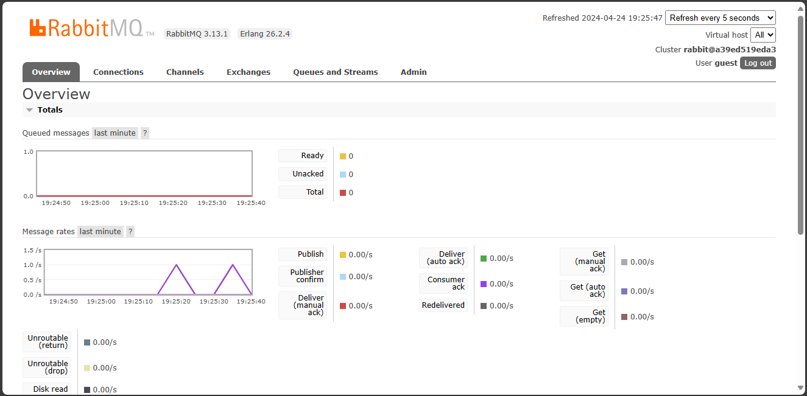

## AMQP
There are 5 data the publisher program will send to the message broker when it is ran once. This is because there are 5 messages published in main.rs. Each are considered as one data sent to the queue.

The url is the same as in the subscriber, however, in the publisher, it is used on new_queue_publisher. In the subsciber, it is used on new_queue_listener. This means that the data sent by the publisher to the queue will be received by the subscriber.

The image above shows the subscriber consuming the messages inside the queue which is sent by the publisher.

On the image above, there are two diagrams. The one on the top shows the number of messages in the queue. The second one shows the rate in which messages are delivered.

